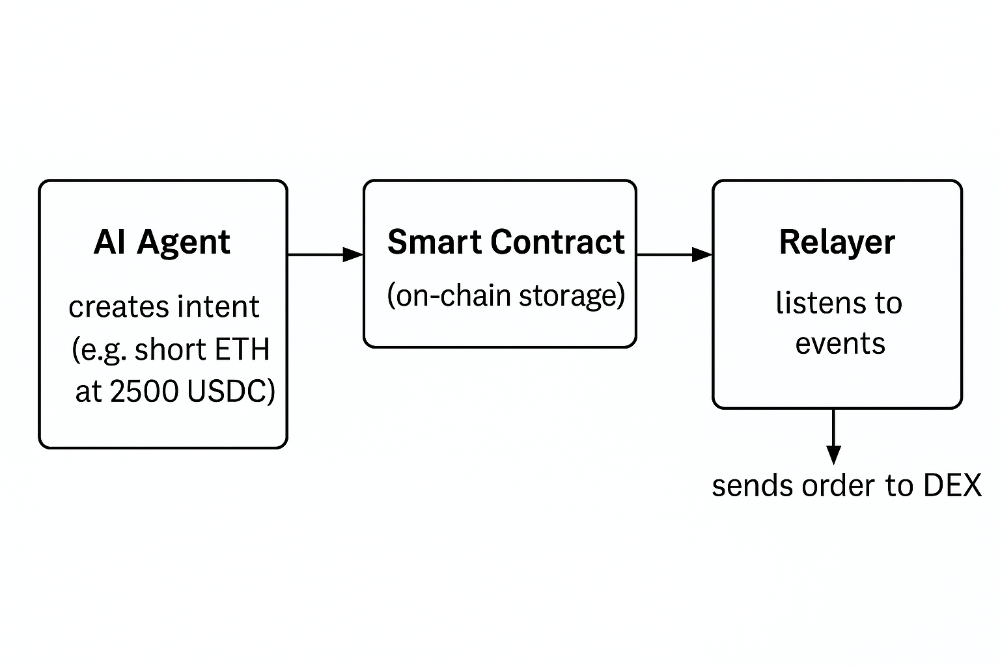

# 🔁 RelayNet

**RelayNet** is a decentralized intent-based execution protocol that bridges **on-chain intent creation** with **off-chain trade execution**. It enables users (or agents acting on their behalf) to submit trade instructions on-chain. A **stateless off-chain relayer** listens for these instructions and automatically executes trades on platforms like **Hyperliquid** or **Drift**.

RelayNet supports both human users and autonomous AI agents, making it ideal for automated DeFi strategies such as arbitrage, delta-neutral trading, or AI-driven yield farming. The user or agent defines the **intent** (e.g., “short ETH if price drops below $2,500”)—and the relayer does the rest.


---

## ✨ Features

### 🧠 System Architecture: AI Agent Intent Flow

This system allows an AI agent to express a trading intent on-chain, which is later executed by a relayer bot.



### ✅ On-Chain Smart Contract 

*Located at:* `RelayNet/solidity/contracts/IntentStorage.sol`

- Stores trade instructions via the `Intent` struct:
  - Fields: `platform`, `coin`, `side`, `size`, `minPrice`, `timestamp`, `status`
- Uses Solidity `enum` types to reduce ambiguity (`Platform`, `Side`, `Status`)
- Designed for deployment on **Arbitrum mainnet**
- Lifecycle functions:
  - `createIntent()` – Submit a new intent
  - `updateIntent()` – Modify an existing intent
  - `clearIntent()` – Cancel the intent

---

### 🔄 Off-Chain Relayer

*Located at:* `RelayNet/src/relayer.py`

- Listens to on-chain events:
  - `IntentCreated`, `IntentUpdated`, `IntentCancelled`
- Executes or cancels trades on **Hyperliquid** based on on-chain state
- Supported actions:
  - Market buys and sells
  - Order cancellation
  - Cancel + replace for updates

---

### 🧠 Intent Management CLI 

*Located at:* `RelayNet/src/createIntent.py`

- Command-line tool for managing intents via user or agent
- Sends signed transactions to the `IntentStorage` contract
- Supported commands:
  - `create` – Create a new intent
  - `update` – Modify existing intent
  - `delete` – Cancel current intent
  - `check` – View on-chain intent
  - `summary` – View wallet balances and positions
- Ideal for automation, bot agents, or manual interaction

---


- 🌉 **Cross-chain-ready architecture**

  - Easily extendable to support additional trading platforms like Drift, Vertex, or cross-chain messaging layers

- 🔐 **Trust-minimized by design**

  - On-chain state is fully transparent and queryable by users
  - The off-chain relayer performs stateless execution: no privileged access or off-chain storage
  - Compact and auditable storage format using Solidity `enum` and `bytes32`

## 🚀 How to Run

Follow these steps to set up and execute RelayNet:

1. **Create a Hyperliquid Account**

   - Connect your wallet on [https://app.hyperliquid.xyz](https://app.hyperliquid.xyz)
   - Deposit **USDC** and transfer it to your **Perps** balance

2. **Deploy the Solidity Contract**

   - Deploy `RelayNet/solidity/contracts/IntentStorage.sol` to **Arbitrum mainnet**
   - Verify and publish the contract on Arbiscan (optional but recommended)

3. **Run the Relayer**

   - The relayer listens to on-chain events and automatically executes or cancels trades
   - Start the relayer:
     ```bash
     python src/relayer.py
     ```

4. **Create or Modify an Intent**

   - Make sure your `.env` file is configured with the following keys:

     ```
     RPC_URL=
     PRIVATE_KEY=
     CONTRACT_ADDRESS=
     USER=
     ```

   - Then run:

     ```bash
     # Create a new intent (if none active)
     python src/createIntent.py create

     # Update existing intent (must be active)
     python src/createIntent.py update

     # Cancel current intent (if active)
     python src/createIntent.py delete

     # View current intent details
     python src/createIntent.py check

     # View current account status (balances, positions etc)
     python src/createIntent.py summary

     ```
